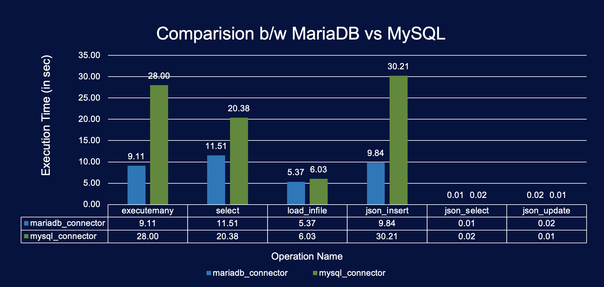

# 🚀 Ctrl_Alt_db — Airflow MariaDB Connector

**Team Name:** Ctrl_Alt_db  
**Project Title:** Airflow MariaDB Connector  
**Theme:** Integration  

---

## 🧩 Problem Statement

Apache Airflow currently lacks **native integration with MariaDB**, forcing developers to rely on the MySQL connector.  
However, this connector is **incompatible with key MariaDB-specific features** such as:

- ⚡ **ColumnStore**
- 📥 **cpimport**
- 🧠 **Native JSON functions**

This limitation results in **reduced functionality** and **performance bottlenecks** in ETL workflows.  
Data pipelines built on Airflow cannot fully leverage **MariaDB’s high-performance architecture**.

> 🔍 **Benchmark Insight:**  
> The MariaDB Python connector outperforms the MySQL connector by up to **3×** in operations like:
> - `executemany`
> - `SELECT`
> - `JSON_INSERT`

The absence of a native Airflow–MariaDB connector thus limits Airflow’s ability to orchestrate **modern, high-performance, and scalable MariaDB data workflows**.

---

## 💡 Solution Overview

The **Airflow MariaDB Connector** introduces **seamless, native integration** between **Apache Airflow** and **MariaDB (including ColumnStore)**.

### ✅ Key Features

- 🧩 **Native Airflow connection type** for direct MariaDB integration (no MySQL fallback)
- 🚀 **High-speed data ingestion** using `cpimport`, optimized for bulk ETL operations
- 🔄 **ETL workflows**: download → transform → load between **MariaDB** and **S3**
- 📊 **Columnar architecture support** for faster analytical queries
- ⚙️ **3× performance improvement** over MySQL connector for critical database operations

---
## ⚡ Performance Comparison: MariaDB vs MySQL

We ran a quick benchmark using `mariadb_and_sql.py` to compare the **execution speed of common operations**.  
The results clearly demonstrate the **performance advantage of MariaDB’s Python connector over MySQL**, especially for bulk inserts, SELECT queries, and JSON operations.



Note: 
- Above analysis was done on a local machine with 1Million records.
- Code ref: https://github.com/Pratush12/mariadb-airflow-hackathon/blob/main/mysql_vs_mariadb.py

---
## 🧠 Concept

### 🎯 Goal
Build a **seamless ETL integration** between **Apache Airflow** and **MariaDB ColumnStore**.

### 💭 Idea
Automate **OpenFlights** data ingestion using:
- **Airflow DAGs** for orchestration
- **Secure SSH transfers**
- **cpimport** for high-performance bulk loading into ColumnStore

---

## 🏗️ Principles & Design

| Principle   | Description |
|--------------|-------------|
| 🔁 **Automation** | Entire data pipeline runs automatically via Airflow scheduling |
| 🔐 **Security** | Uses SSH-based file transfer — no direct DB exposure |
| ⚖️ **Scalability** | ColumnStore ensures distributed & parallel data loading |
| 🧩 **Modularity** | Each dataset (airports, airlines, routes, etc.) is processed independently |
| 🔄 **Reusability** | DAG supports adding new datasets via simple JSON config updates |

---

## ⚙️ Installation & Setup Instructions

Choose the installation method that best fits your needs:

---

### 🚀 Option 1: Quick Install (Recommended for Production)

Install the MariaDB provider directly from GitHub:

```bash
# Install the latest version
pip install -U git+https://github.com/Pratush12/mariadb-airflow-hackathon.git@main#subdirectory=airflow-mariadb-provider

# Or install with all optional dependencies (S3, SSH support)
pip install -U "git+https://github.com/Pratush12/mariadb-airflow-hackathon.git@main#subdirectory=airflow-mariadb-provider[all]"
```

**Requirements:**
- Python 3.8+
- Apache Airflow 2.5.0+
- MariaDB server (for database operations)
- SSH access (for cpimport operations)

---

### 🔧 Option 2: Clone and Install (Development)

For development or customization:

```bash
# Clone the repository
git clone https://github.com/Pratush12/mariadb-airflow-hackathon.git
cd mariadb-airflow-hackathon/airflow-mariadb-provider

# Install in development mode
pip install -e ".[all]"

# Or install with specific features
pip install -e ".[amazon]"  # S3 support
pip install -e ".[ssh]"     # SSH support
```

---

### 🐳 Option 3: Docker Setup (Full Development Environment)

For a complete development environment with MariaDB ColumnStore:

#### 🧱 Step 1: Add Custom Provider to Airflow

Since Airflow doesn't natively support MariaDB, we created a **custom provider**.

This provider:
- Adds **MariaDB connection type**
- Provides **S3 hooks** and **cpimport operators**
- Enables **direct integration** with MariaDB from Airflow DAGs

```bash
# Clone or copy your provider into the airflow directory
COPY ./mariadb /opt/airflow/.local/src/airflow-mariadb-provider

# Install the provider
pip install -e /opt/airflow/.local/src/airflow-mariadb-provider
```

---

## 🏃‍♂️ Quick Start

After installation, create a MariaDB connection in Airflow:

1. **Go to Admin → Connections** in Airflow UI (`localhost:8080`)
2. **Add new connection:**
   - **Connection ID**: `mariadb_default`
   - **Connection Type**: `MariaDB`
   - **Host**: Your MariaDB server
   - **Port**: 3306
   - **Login**: Your username
   - **Password**: Your password
   - **Schema**: Your database name

3. **Use the operators in your DAGs:**
```python
from airflow.providers.mariadb.operators.mariadb import MariaDBOperator

# Basic SQL execution
sql_task = MariaDBOperator(
    task_id="execute_sql",
    mariadb_conn_id="mariadb_default",
    sql="SELECT * FROM my_table"
)
```

---

### 🐬 Step 2: Install MariaDB with ColumnStore Engine

We use MariaDB ColumnStore inside Docker for high-performance analytical queries.

```bash
docker run -d -p 3307:3306 -p 2222:22 --shm-size=512m -e PM1=mcs1 --hostname=mcs1 mariadb/columnstore
docker exec -it mcs1 provision mcs1
```

🧠 Why ColumnStore?
It enables parallelized columnar data storage — perfect for analytical workloads.

### ⚓ Step 3: Connect Airflow to MariaDB via Docker Network

```bash
docker network connect airflow_net mcs1
docker-compose down -v
docker-compose up -d
```

Your docker-compose.yml connects both containers (Airflow + MariaDB) via the same network for smooth communication.

### 🐳 Step 4: Dockerfile for Airflow with MariaDB Connector

```bash
# Use the official Airflow image
FROM apache/airflow:2.9.0

USER root

# Install dependencies for MariaDB
RUN apt-get update && \
    apt-get install -y --no-install-recommends \
        gcc \
        libmariadb-dev \
        mariadb-client && \
    apt-get clean && rm -rf /var/lib/apt/lists/*

USER airflow
ENV PATH="/home/airflow/.local/bin:${PATH}"

# Install Python MariaDB driver
RUN pip install --no-cache-dir mariadb

# Copy and install custom provider
COPY --chown=airflow:airflow ./airflow-mariadb-provider /opt/airflow/.local/src/airflow-mariadb-provider
RUN pip install --no-cache-dir -e /opt/airflow/.local/src/airflow-mariadb-provider
```

### 🔐 Step 5: Enable SSH Connection in MariaDB Container

SSH is used for secure file transfers (e.g., CSV → cpimport).

```bash
docker exec -it mcs1 bash
ssh-keygen -A
/usr/sbin/sshd -D &
exit
```

Then restart the Airflow webserver:

```bash
docker restart airflow-docker-airflow-webserver-1
```

## 🔗 Airflow Connections

Once Airflow is running, configure these connections in the Airflow UI (`localhost:8080 → Admin → Connections`):

| Connection ID              | Type    | Description                                                             |
| -------------------------- | ------- | ----------------------------------------------------------------------- |
| `mariadb_default`          | MariaDB | Host: `mcs1`, Port: `3306`, User: `root`, Password: `mariadb_root_pass` |
| `mariadb_ssh_connection`   | SSH     | Host: `mcs1`, Port: `22`, Username: `root`, Password: `mariadb_root_pass`   |
| `aws_default` *(optional)* | S3      | For S3 data transfer workflows                                          |

---

## 📂 Project Structure

Below is the overall structure of the project:

```
project-root/
│
├─ README.md # Project documentation
├─ docker-compose.yml # Docker Compose setup for Airflow + MariaDB
├─ Dockerfile # Custom Airflow image with MariaDB connector
├─ images/ # Screenshots, performance charts
│ └─ performance_comparison.png
├─ dags/ # Airflow DAGs
│ └─ openflights_dag.py
|  └─ mariadb_s3_operators_dag.py
├─ airflow-mariadb-provider/ # Custom Airflow provider
│ ├─ airflow_mariadb_provider/ # Main provider module
│ │ ├─ init.py
│ │ ├─ hooks/ # Hooks for MariaDB, S3, cpimport
│ │ │ └─ mariadb_hook.py
│ │ ├─ operators/ # Custom Airflow operators
│ │  ├─ mariadb_cpimport_operator.py # Bulk loading via cpimport
│ │  ├─ mariadb_operator.py # Generic MariaDB task execution
│ │  ├─ mariadb_s3_dump_operator.py # Uploads MariaDB data to S3
│ │  └─ mariadb_s3_load_operator.py # Loads data from S3 into MariaDB
│ └─ setup.py # Installation and package setup
```

---
## 🧪 Running the DAG

Start Airflow UI → [http://localhost:8080](http://localhost:8080)

Trigger the DAG: **OpenFlights Data Ingestion**

Watch:

- 🗂️ SSH file upload logs  
- ⚙️ cpimport execution  
- 📊 Data validation queries inside MariaDB  

---

## 🧭 Outcome & Learnings

Through this project, we successfully:

- ✅ Built the first Airflow–MariaDB native connector  
- ✅ Integrated MariaDB ColumnStore for parallel ETL  
- ✅ Learned Airflow provider development and Docker networking  
- ✅ Explored secure SSH integration for data transfer  
- ✅ Benchmarked MariaDB vs MySQL connector performance  

> 💬 “This hackathon gave us deep insights into how Airflow orchestrates ETL pipelines and how MariaDB’s performance capabilities can be unlocked with the right integration.”

---

## 🏁 Conclusion

The **Airflow MariaDB Connector** bridges a major integration gap in modern data engineering.  

It enables:

- ⚡ Direct and optimized Airflow–MariaDB communication  
- 🚀 High-speed ETL via cpimport  
- 📈 Scalable analytics with ColumnStore  

With this, **Ctrl_Alt_db** has taken the first step toward empowering the Airflow community with a truly MariaDB-native data orchestration solution.
